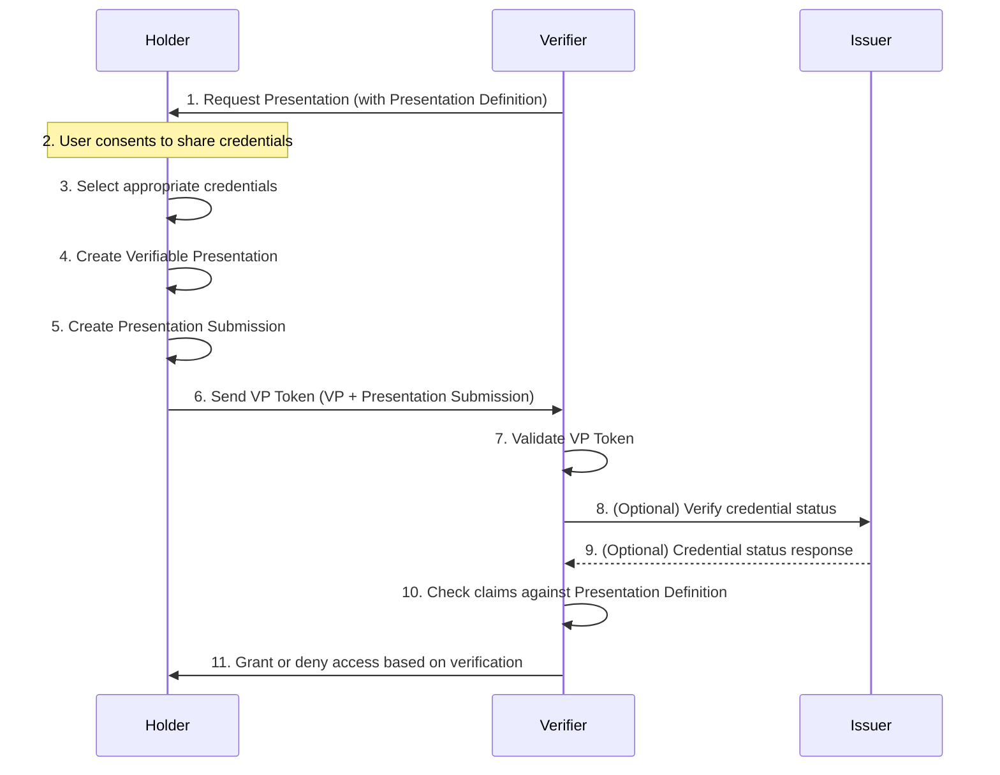

# OpenID for Verifiable Presentations (OID4VP)

[](https://crates.io/crates/oid4vp)
[](https://docs.rs/oid4vp)
[](https://opensource.org/licenses/MIT)

### Rust implementation of the OpenID for Verifiable Presentations (OID4VP) specification.


## Install

Add the following to your `Cargo.toml`:

```toml
[dependencies]
openid4vp = "0.1"
```

or

```shell
cargo add openid4vp
```

## Testing

Ensure the `/tests/presentation-exchange` submodule is initialized, run the following in the root of the project:

```shell
git submodule init --recursive
```


## Presentation Exchange Overview




## License

This project is licensed under the MIT License - see the [LICENSE](LICENSE) file for details.
