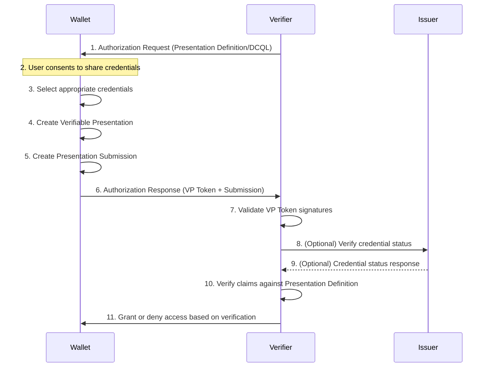

# OpenID for Verifiable Presentations (OID4VP)

[](https://crates.io/crates/openid4vp)
[](https://docs.rs/openid4vp)
[](https://opensource.org/licenses/MIT)

Rust implementation of the OpenID for Verifiable Presentations (OID4VP) specification.

<!-- cargo-rdme start -->
<!-- cargo-rdme end -->

## Install

Add the following to your `Cargo.toml`:

```toml
[dependencies]
openid4vp = "0.1"
```

or

```shell
cargo add openid4vp
```

## Testing

Ensure the `/tests/presentation-exchange` submodule is initialized by running the following in the root of the project:

```shell
git submodule init --recursive
```

## Protocol Flow Diagram



## Examples

Check the [`examples`](examples/) directory for complete implementations:
- [`cli-verifier`](examples/cli-verifier/): Command-line verifier for testing OID4VP flows
- [`verifier-conformance-adapter`](examples/verifier-conformance-adapter/): Conformance testing adapter
- [`oid4vp-wallet-adapter`](examples/oid4vp-wallet-adapter/): Headless wallet adapter

## License

This project is licensed under the MIT License - see the [LICENSE](LICENSE) file for details.
