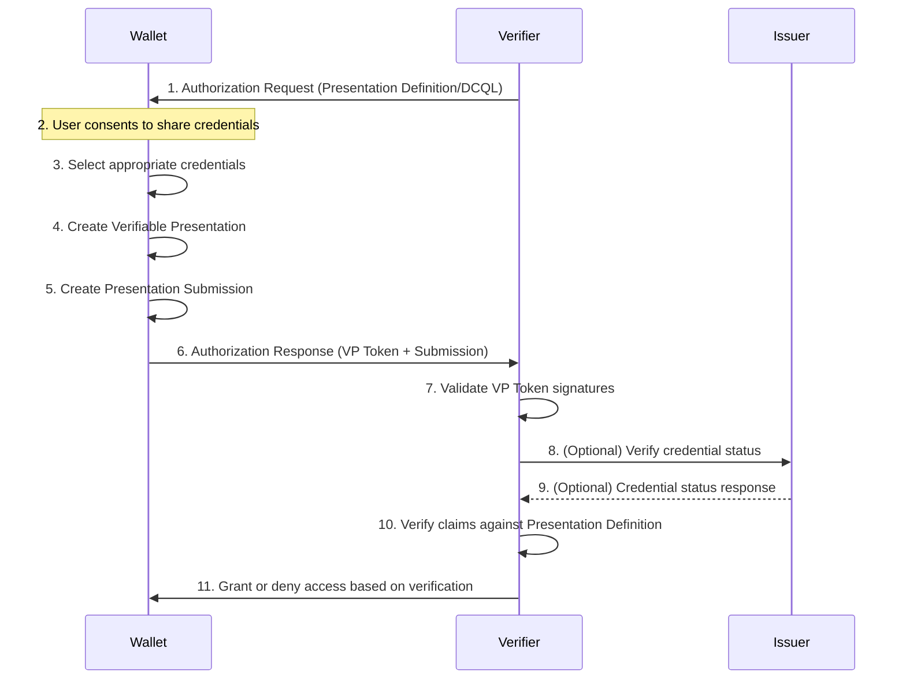

# OpenID for Verifiable Presentations (OID4VP)

[](https://crates.io/crates/openid4vp)
[](https://docs.rs/openid4vp)
[](https://opensource.org/licenses/MIT)

Rust implementation of the OpenID for Verifiable Presentations (OID4VP) specification.

<!-- cargo-rdme start -->

This library provides a Rust implementation of [OID4VP 1.0].

[OID4VP 1.0]: <https://openid.net/specs/openid-4-verifiable-presentations-1_0.html>

## Verifier Usage

You can create a verifier implementation using the [`Verifier`] type as follows:

```rust
use openid4vp::verifier::Verifier;
use openid4vp::core::dcql_query::{DcqlQuery, DcqlCredentialQuery};
use openid4vp::core::credential_format::ClaimFormatDesignation;
use openid4vp::core::authorization_request::parameters::{ResponseMode, ResponseType};
use openid4vp::utils::NonEmptyVec;

// Setup verifier.
let verifier = Verifier::builder()
    .with_client(client)
    .with_session_store(session_store)
    .with_submission_endpoint(submission_url)
    .build()
    .await?;

// Build a DCQL query for credential requirements.
let credential_query = DcqlCredentialQuery::new(
    "mdl_credential".to_string(),
    ClaimFormatDesignation::MsoMDoc,
);
let dcql_query = DcqlQuery::new(NonEmptyVec::new(credential_query));

// Build an authorization request.
let (uuid, request_url) = verifier
    .build_authorization_request()
    .with_dcql_query(dcql_query)
    .with_request_parameter(ResponseType::VpToken)
    .with_request_parameter(ResponseMode::DirectPost)
    .build(wallet_metadata)
    .await?;

// Present the request to the wallet (e.g., as a QR code).
let qr_code = generate_qr_code(&request_url)?;

// Poll for the response status.
let status = verifier.poll_status(uuid).await?;

// When the wallet responds, verify the response.
verifier.verify_response(uuid, authorization_response, |session, response| {
    Box::pin(async move {
        // Validate the VP token and verify claims.
        validate_vp_token(session, response).await
    })
}).await?;
```

The verifier's behavior can be customized by implementing the [`Client`] and
[`SessionStore`] traits.

[`Verifier`]: https://docs.rs/openid4vp/latest/openid4vp/verifier/struct.Verifier.html
[`Client`]: https://docs.rs/openid4vp/latest/openid4vp/verifier/client/trait.Client.html
[`SessionStore`]: https://docs.rs/openid4vp/latest/openid4vp/verifier/session/trait.SessionStore.html

## Wallet Usage

Wallets can be implemented by using the [`Wallet`] trait:

```rust
use openid4vp::wallet::Wallet;
use openid4vp::core::authorization_request::verification::RequestVerifier;
use openid4vp::core::authorization_request::AuthorizationRequestObject;
use openid4vp::core::metadata::WalletMetadata;
use openid4vp::core::response::{AuthorizationResponse, UnencodedAuthorizationResponse};
use openid4vp::core::response::parameters::VpToken;
use anyhow::Result;
use async_trait::async_trait;

struct MyWallet {
    metadata: WalletMetadata,
    http_client: MyHttpClient,
}

#[async_trait]
impl Wallet for MyWallet {
    type HttpClient = MyHttpClient;

    fn metadata(&self) -> &WalletMetadata {
        &self.metadata
    }

    fn http_client(&self) -> &Self::HttpClient {
        &self.http_client
    }
}

// Implement RequestVerifier for client identifier schemes per OID4VP Section 5.9
#[async_trait]
impl RequestVerifier for MyWallet {
    async fn redirect_uri(
        &self,
        decoded_request: &AuthorizationRequestObject,
        request_jwt: Option<String>,
    ) -> Result<()> {
        // Verify redirect_uri scheme requests (unsigned JWTs per Section 5.9.3)
        Ok(())
    }

    async fn decentralized_identifier(
        &self,
        decoded_request: &AuthorizationRequestObject,
        request_jwt: Option<String>,
    ) -> Result<()> {
        // Verify DID-based requests (signed with DID key per Section 5.9.3)
        Ok(())
    }
}

// Parse and validate an authorization request.
let request_object = wallet.validate_request(request_url).await?;

// Create VP token with credentials matching the DCQL query.
let vp_token = create_vp_token_for_request(&request_object)?;
let response = AuthorizationResponse::Unencoded(
    UnencodedAuthorizationResponse::new(vp_token)
);

// Submit the authorization response.
wallet.submit_response(request_object, response).await?;
```

[`Wallet`]: https://docs.rs/openid4vp/latest/openid4vp/wallet/trait.Wallet.html

## Protocol Overview

Here is a simplified overview of the OID4VP protocol, referencing the
various types and methods implementing it.

### Authorization Request

1. *Verifier creates request*: The verifier creates an [`AuthorizationRequest`]
   containing a DCQL query specifying what credentials are required.
2. *Request delivery*: The request is delivered to the wallet, typically via QR code,
   deep link, or by reference.
3. *Wallet validates request*: The wallet validates the request signature and metadata
   using a [`RequestVerifier`] implementation.

All the code related to Authorization Requests is located in the
[`core::authorization_request`] module.

[`AuthorizationRequest`]: https://docs.rs/openid4vp/latest/openid4vp/core/authorization_request/struct.AuthorizationRequest.html
[`RequestVerifier`]: https://docs.rs/openid4vp/latest/openid4vp/core/authorization_request/verification/trait.RequestVerifier.html
[`core::authorization_request`]: https://docs.rs/openid4vp/latest/openid4vp/core/authorization_request/

### Credential Selection and Presentation

4. *Wallet processes query*: The wallet evaluates the DCQL query against available credentials.
5. *User consent*: The wallet presents matching credentials to the user for consent.
6. *VP creation*: The wallet creates a Verifiable Presentation containing the
   selected credentials.
7. *Response submission*: The wallet submits an [`AuthorizationResponse`] containing
   the VP token and presentation submission.

All the code related to Authorization Responses is located in the
[`core::response`] module.

[`AuthorizationResponse`]: https://docs.rs/openid4vp/latest/openid4vp/core/response/enum.AuthorizationResponse.html
[`core::response`]: https://docs.rs/openid4vp/latest/openid4vp/core/response/

### Verification

8. *Verifier validates response*: The verifier validates the VP token signatures
   and checks the presentation submission against the original request.
9. *Claim extraction and verification*: The verifier extracts and validates the
   requested claims from the credentials.

## Credential Formats

This library supports the credential formats defined in OID4VP v1.0 Appendix B:
- **JWT VC** (`jwt_vc_json`): W3C Verifiable Credentials secured with JWT
- **LDP VC** (`ldp_vc`): W3C Verifiable Credentials with Linked Data Proofs
- **SD-JWT VC** (`dc+sd-jwt`): IETF SD-JWT Verifiable Credentials
- **mso_mdoc** (`mso_mdoc`): ISO/IEC 18013-5 mobile documents (mDL, etc.)

Format identifiers and handling are defined in the [`core::credential_format`] module.

[`core::credential_format`]: https://docs.rs/openid4vp/latest/openid4vp/core/credential_format/

## Query Language

This library uses **DCQL** (Digital Credentials Query Language) for specifying credential
requirements. DCQL is the native query language of OID4VP v1.0 (Section 6) and provides
precise control over credential selection, including support for:
- Multiple credential formats in a single query
- OR/AND logic via `credential_sets`
- Selective disclosure with `claims` constraints
- Trusted issuer specification via `trusted_authorities`
- Value matching with `values` arrays

DCQL support is provided in the [`core::dcql_query`] module.

[`core::dcql_query`]: https://docs.rs/openid4vp/latest/openid4vp/core/dcql_query/

<!-- cargo-rdme end -->

## Install

Add the following to your `Cargo.toml`:

```toml
[dependencies]
openid4vp = "0.1"
```

or

```shell
cargo add openid4vp
```

## Testing

Ensure the `/tests/presentation-exchange` submodule is initialized by running the following in the root of the project:

```shell
git submodule init --recursive
```

## Protocol Flow Diagram



## Examples

Check the [`examples`](examples/) directory for complete implementations:
- [`cli-verifier`](examples/cli-verifier/): Command-line verifier for testing OID4VP flows
- [`verifier-conformance-adapter`](examples/verifier-conformance-adapter/): Conformance testing adapter
- [`oid4vp-wallet-adapter`](examples/oid4vp-wallet-adapter/): Headless wallet adapter

## License

This project is licensed under the MIT License - see the [LICENSE](LICENSE) file for details.
